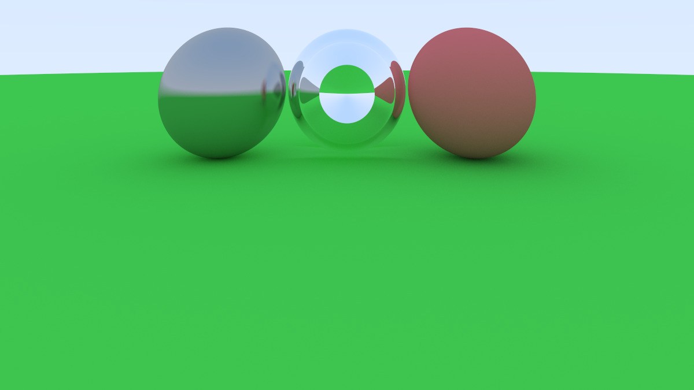
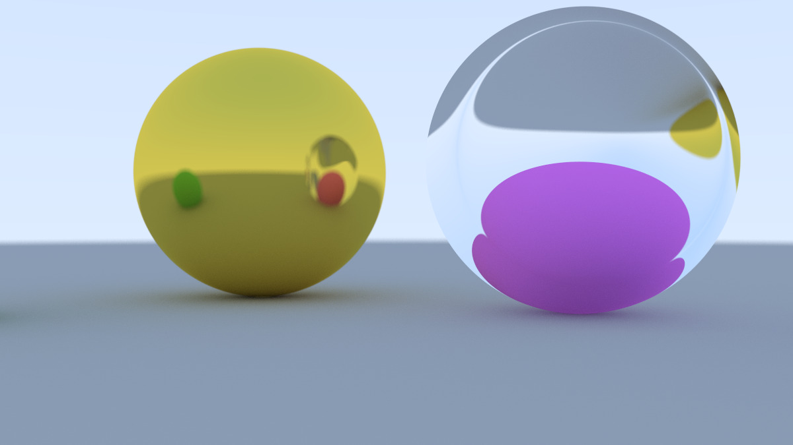
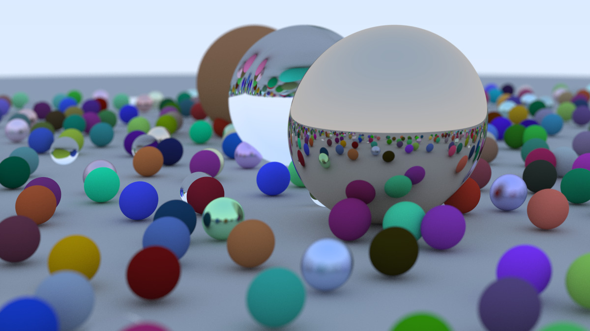

# Ray Tracing in One Weekend
My ray tracer implementation following the "Ray Tracing in One Weekend" book by Peter Shirley.

## ⚙️ Features
- Anti-aliasing

- Diffuse, Metal and Dielectric Materials

- Depth of Field

## 🖼️ Final Result

## Source
[_Ray Tracing in One Weekend_](https://raytracing.github.io/books/RayTracingInOneWeekend.html)
